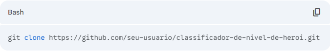
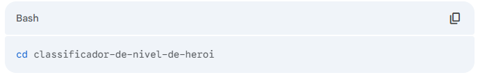
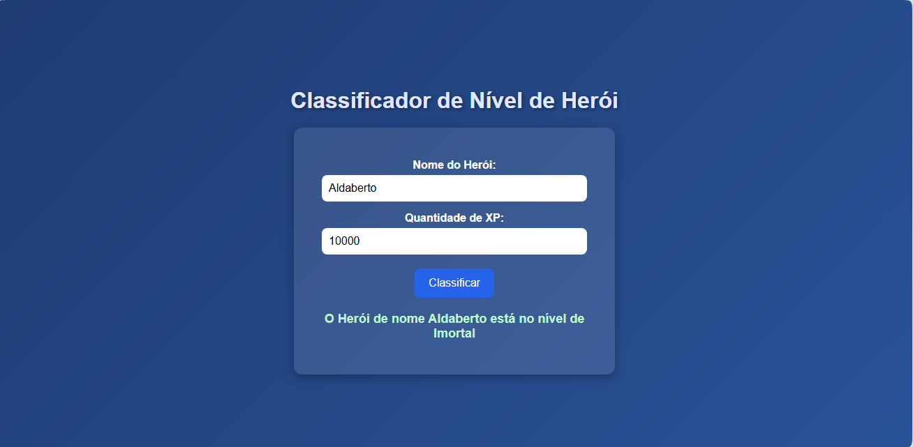

## ⚔️ Desafio Classificador de Nível de Herói

Um projeto simples em HTML, CSS e JavaScript que classifica o nível de um herói com base em seus pontos de experiência (XP).

## 📝 Resumo do Projeto

Este projeto é um Classificador de Nível de Herói, que determina o nível de um herói com base em seus pontos de experiência (XP). Utilizando variáveis, operadores e estruturas de decisão, a aplicação compara a XP fornecida com faixas predefinidas para classificar o herói em níveis como Ferro, Bronze, Ouro e outros. O resultado final exibe o nome do herói e seu nível correspondente.

## 🚀 Como Usar
1. Clone o repositório:
   

2. Navegue até o diretório do projeto:
   

3. Abra o arquivo index.html em seu navegador de preferência.

Você pode simplesmente clicar duas vezes no arquivo ou usar um comando como open index.html no terminal (em sistemas macOS) ou start index.html (em sistemas Windows).

## 🎯 Objetivo do Desafio
O Que deve ser utilizado:

**Variáveis**

**Operadores**

- Laços de repetição (embora não essenciais para a solução, podem ser explorados)

- Estruturas de decisões (if-else)

- Critérios de Classificação:

**Ferro: XP menor que 1.000**

**Bronze: XP entre 1.001 e 2.000**

**Prata: XP entre 2.001 e 5.000**

**Ouro: XP entre 5.001 e 7.000**

**Platina: XP entre 7.001 e 8.000**

**Ascendente: XP entre 8.001 e 9.000**

**Imortal: XP entre 9.001 e 10.000**

**Radiante: XP maior ou igual a 10.001**

## Saída:

A mensagem final deve ser: "O Herói de nome {nome} está no nível de {nivel}".

Projeto 

